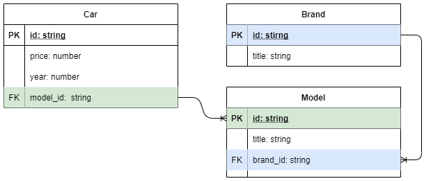
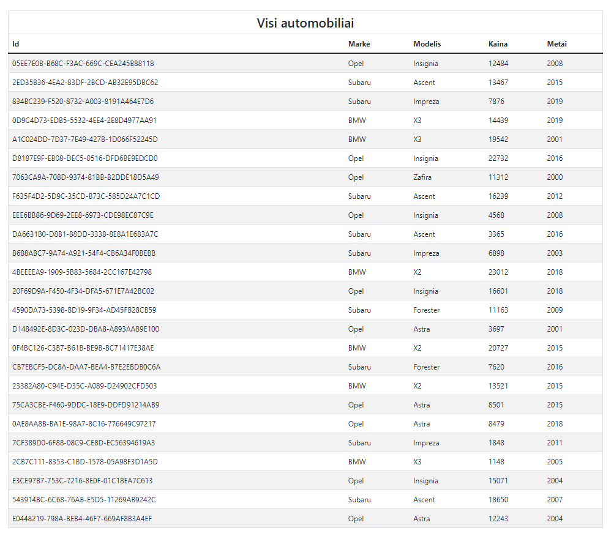

# TypeScript - CRUD užduotis 1

## Užduoties tikslas

Atvaizduoti duomenis HTML lentele, pagal esybių schemą.

### Failų struktūra

- **components/** - aplankas skirtas komponentams - klasėms, kurios naudojamos atvaizduoti elementams DOM'e

- **data/** - duomenų failai

- **helpers/** - Pagalibinės funkcijos ir klasės, skirtos kodo švarinimui ir perpanaudojimui

- **types/** - bendrai naudojami tipai

### Esybių ryšių diagrama (entity relation diagram).

## Darbo atlikimo eiga

1. Aplanke **./types** duoti tipų 'griaučiai'. Implementuokite tipus pagal schemą. **car-joined.ts** tipas turi turėti tokias savybes:

   - id: string
   - price: number
   - year: number
   - brand: string
   - model: string

2. **./helpers/cars-collection.ts**

   1. Sukurkite konstruktorių, kuris priimtų markes, mašinas ir modelius. Gautus duomenis išsaugokite objekte
   2. Sukurkite privatų metodą **joinCar** kuris apjungtų vieną mašiną
   3. Sukurkite metodą, kurį iškvietus gautumėte visas apjungtas mašinas.

3. **./components/app.ts**

   1. Sukurkite savybes:
      1. private htmlElement: HTMLElement;
      2. private carsCollection: CarsCollection;
   2. Sukurkite konstruktorių, kuris
      1. priimtų selektorių ir pagal jį rastą elementą priskirtų į **htmlElement** savybę.
      2. sukurtų pradinį **carsCollection** objektą
   3. Sukurkite metodą **initialize**, kuriame būtų atliekami komponento atvaizdavimo veiksmai

4. **./components/table.ts**

   1. Sukurkite tipą TableProps<Type>:
      1. title: string
      2. columns: Type
      3. rowsData: Type[]
   2. Sukurkite savybes:
      1. public htmlElement: HTMLTableElement;
      2. private props: TableProps<Type>;
      3. private tbody: HTMLTableSectionElement;
      4. private thead: HTMLTableSectionElement;
   3. Sukurkite konstruktorių, kuris:
      1. sukurtų pradinius htmlElement, thead ir tbody elementus
      2. iškviestų metodą **initialize**
   4. Sukurtite metodą **initialize**, kuriame:
      1. atliktumete lentelės antraštės atvaizdavimą
      2. atliktumetė lentelės duomenų eilučių atvaizdavimą
      3. apjungtumėte elementus

5. **./components/app.ts**
   1. papildykite **initialize** metodą, jog būtų įterpiama lentelė

## Rezultato pavyzdys

## Papildomai

- Sukurkite lentelės duomenų patikrinimo funkciją, kuri tikrintų duomenų sutapimą su antraštės stulpeliais
- Kodo dalis, kurios gali būti perpanaudotos iškelkite į atskiras funkcijas aplanke **helpers**

## Atsakymai

- GaliTE peržiūrėti sprendimą aplanke **./atsakymas**
